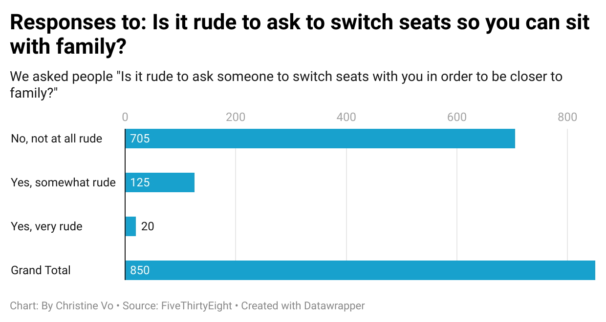

# Journalism Class HW due 6/22
## Why I picked the question that I did
I picked the question, "Is it rude to ask someone to switch seats with you in order to be closer to family?", because it's a thought that crossed my mind when younger. My father asked strangers once when I was younger if they would be willing to switch seats with him so he could sit with my younger siblings! I am a people pleaser, so my initial thought is that it isn't rude, but I would prefer not to ask in the case it would upset someone. 

## What I found interesting about the dataset + chart explanation and what it reveals
I found it very interesting that 125 out of 850 total people find it somewhat rude. That is almost 15%... I wonder why people believe it is "somewhat rude", maybe they just find it annoying hah. There is also 20 people who believe yes it is rude, which is a little more than 2% which is interesting, I didn't think anyone would find it definetely rude. My chart shows that while some think it’s a little rude, very few think it’s very rude. It reveals that asking to switch seats for family reasons is typically seen as valid/okay.

Below is my chart:

